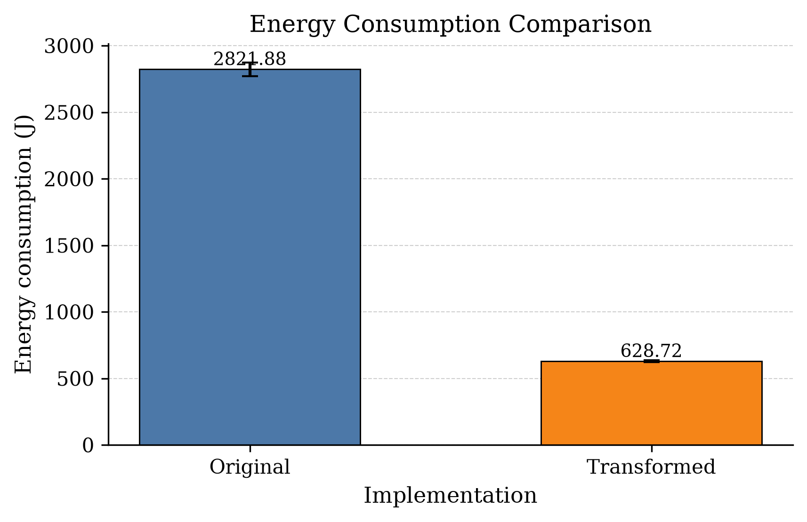
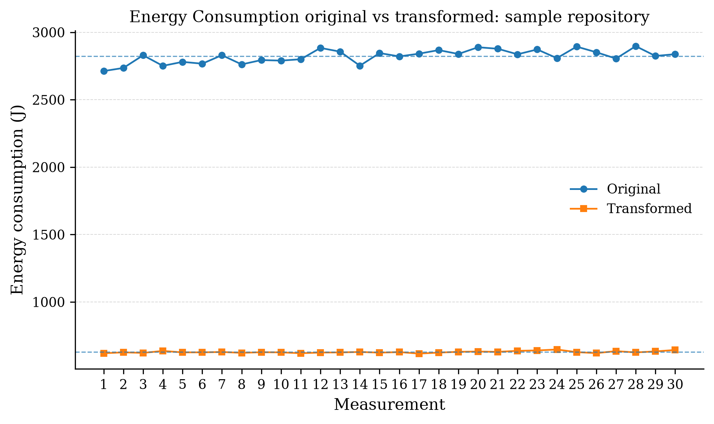

# GreenCodeRefactor

**Rule-based, AST-driven automatic code refactoring for energy-efficient software.**

GreenCodeRefactor is a research-oriented tool that automatically applies a small set of
behavior-preserving code transformations aimed at reducing the energy consumption and
improving the maintainability of software systems. It provides **two independent
implementations** of the same transformation engine — one in **Java** (built on
[JavaParser](https://github.com/javaparser/javaparser)) and one in **Python** (built on the
standard-library `ast` module) — so the transformation rules can be studied, compared, and
executed in either ecosystem.

The transformation rules are aligned with well-known static-analysis rules from
[SonarQube](https://www.sonarsource.com/) (RSPEC-1481 and RSPEC-1854) and with the
refactoring technique T10 (*explicit raise to except body*), defined in the practice-based
classification of code smells used by the BENEVOL community. The repository also ships the
full experimental evidence used to validate the approach:

- **LLM-based validation**: 30 independent iterations in which an LLM agent performed the
  same refactorings on the benchmark subject; **30/30 iterations were validated as
  behavior-preserving**.
- **Energy evaluation**: 30 wall-clock + energy measurement runs (Linux `perf` / RAPL) of the
  original versus the transformed benchmark, showing a measured reduction of ≈ **78% in
  energy consumption** and ≈ **77% in execution time**.

---

## 1. Motivation

Energy efficiency has become a first-class quality attribute for software. Refactoring is a
low-risk way to remove computational waste left over from careless development — *dead
code*, *redundant assignments*, and *exception-based control flow* all consume CPU cycles
(and therefore energy) without contributing to the observable behavior of a program.

GreenCodeRefactor formalizes three of these refactorings as deterministic, *AST-level*
transformations, applies them automatically to a whole codebase, and provides a repeatable
pipeline to **measure the energy impact** of the resulting code on physical hardware.

## 2. Highlights

| Feature | Description |
|---|---|
| **3 transformations** | Unused-local-variables removal, dead-store removal, exception-flow simplification |
| **Dual implementation** | Same rules implemented in Java (JavaParser) and Python (`ast`) |
| **AST-based & deterministic** | Modifications are local to the syntax tree; no textual search-and-replace |
| **Batch processing** | Processes entire directory trees; supports out-of-place and in-place (atomic) modes |
| **Behavior-preserving** | LLM-driven validation: 30/30 iterations behaviourally valid |
| **Measured energy savings** | ≈ −77.7% energy, ≈ −76.6% execution time (30 runs, RAPL `perf`, RSPEC-aligned rules) |

## 3. Available transformations

All transformers are identified by a stable class name that can be passed to the CLI via the
`--rules` argument (comma-separated).

| Transformer | Rule / Reference | What it does |
|---|---|---|
| `UnusedLocalVariablesTransformer` | Sonar **RSPEC-1481** — *Local variables should not be declared if not used* | Detects and removes local variables that are never read. Side-effecting initializers (e.g. method calls) are preserved as standalone statements. |
| `UnusedAssignmentTransformer` | Sonar **RSPEC-1854** — *Assignments should not be redundant* | Removes *dead stores*: consecutive assignments to the same variable/field where the earlier value is never read. |
| `ExplicitRaiseToExceptBodyTransformer` | Technique **T10** — *Explicit raise to except body* | Replaces an explicit `raise SomeException(...)` inside a `try` block (immediately caught by a matching `except` without alias) with the body of the `except` handler. |

### 3.1 `UnusedLocalVariablesTransformer` (RSPEC-1481)

```python
# Before
def operate():
    a = 5
    temp = a * 2     # never read
    message = "hi"   # never read
    return a

# After
def operate():
    a = 5
    return a
```

If the removed variable's initializer has a side effect, the call is kept:

```python
# Before                          # After
def f():
    unused = log_event("start")   # def f():
    return 1                      #     log_event("start")
                                  #     return 1
```

### 3.2 `UnusedAssignmentTransformer` (RSPEC-1854)

```python
# Before                          # After
def f():
    b = 2         # dead store     def f():
    b = 3                       #     b = 3
    b = 10                        #     b = 10
    return b                      #     return b
```

### 3.3 `ExplicitRaiseToExceptBodyTransformer` (T10)

```python
# Before                                                  # After
def process_data(x, data):                                def process_data(x, data):
    result = [0] * len(data)                                  result = [0] * len(data)
    for i in range(len(data)):                                for i in range(len(data)):
        try:                                                      if x == 1:
            if x == 1:                                                  result[i] = data[i] * 2
                result[i] = data[i] * 2                              else:
            else:                                                       result[i] = data[i] * 3
                raise MyException("x is not 1")                 operate()
        except MyException:                                     return result
            result[i] = data[i] * 3
    operate()
    return result
```

The transformer also removes custom exception classes and imports that become unused after
the transformation.

---

## 4. Repository layout

```
greencoderefactor/
├── greencoderefactor-java/          # Java implementation (Maven, Java 17, JavaParser)
│   └── src/main/java/uclm/esi/alarcos/greenteam/greencoderefactor_java/
│       ├── App.java                 # CLI entry point
│       ├── config/                  # logging setup
│       └── transformers/            # transformation engine
│           ├── BaseTransformer.java
│           ├── RefactorService.java
│           ├── TransformerRunner.java
│           ├── sonar/r1481/UnusedLocalVariablesTransformer.java
│           ├── sonar/r1854/UnusedAssignmentTransformer.java
│           └── techniques/t10/ExplicitRaiseToExceptBodyTransformer.java
│
├── greencoderefactor-python/        # Python implementation (stdlib `ast`)
│   ├── main.py                      # CLI entry point
│   ├── refactor.py                  # batch orchestrator
│   ├── config/logger.py             # logging setup
│   ├── trasnsformers/               # transformation engine
│   │   ├── basetransformer.py
│   │   ├── transform.py             # rule registry + AST pipeline
│   │   ├── sonar/r1481/unusedlocalvariablestransformer.py
│   │   ├── sonar/r1854/unusedassignmenttransformer.py
│   │   └── techniques/t10/explicitraisetoexceptbodytransformer.py
│   ├── repo/                        # benchmark subject (deliberately "dirty" code)
│   ├── tests/                       # IN/OUT example fixtures + custom runner
│   └── info.txt                     # log of an end-to-end example execution
│
├── llm-based/                       # LLM-driven validation experiments (30 iterations)
│   ├── iteration1 … iteration30/    # per-iteration output, stats and transformed repo
│   ├── transformation_validation.txt    # per-transformer application trace
│   └── validation_summary.txt           # 30/30 VALID
│
└── energy-results/                  # energy measurement campaign
    ├── original/                    # 30 runs of the original benchmark
    ├── transformed/                 # 30 runs of the transformed benchmark
    └── plots/                       # summary CSV + PNG/PDF figures
```

---

## 5. Modules and usage

### 5.1 Java implementation (`greencoderefactor-java/`)

Requirements: **JDK 17** and **Maven 3.6+**.

Build an executable fat JAR:

```bash
cd greencoderefactor-java
mvn package
```

Run it:

```bash
java -jar target/greencoderefactor-java.jar \
  --input /path/to/source        \
  --output /path/to/output       \
  --rules UnusedLocalVariablesTransformer,UnusedAssignmentTransformer
```

| Argument  | Required | Description |
|---|---|---|
| `--input` | Yes | Directory containing the `.java` files to transform |
| `--output` | Yes | Directory where transformed files are written |
| `--rules` | No | Comma-separated list of transformer class names (default: all) |

The engine traverses the input tree recursively, applies each selected transformer to the
JavaParser AST of every `*.java` file, writes the diff of each change to
`~/greencoderefactor/transformations.log`, and reproduces the source-tree structure in the
output directory.

### 5.2 Python implementation (`greencoderefactor-python/`)

Requirements: **Python 3.8+**. The core transformation engine uses only the standard
library (`ast`, `argparse`, `logging`, `difflib`, …).

```bash
cd greencoderefactor-python

# out-of-place: write result to ./output
python main.py --input ./repo --output ./output \
    --rules ExplicitRaiseToExceptBodyTransformer,UnusedLocalVariablesTransformer

# in-place (atomic): input and output are the same directory
python main.py --input ./output --output ./output \
    --rules UnusedAssignmentTransformer
```

When `--input` and `--output` point to the same directory, the tool transforms files
in-place using temporary files and replaces each original only after a successful
transformation (atomic per file). See `info.txt` for a full logged example run.

Tests / example fixtures (runs without pytest):

```bash
python tests/run_transformation_tests.py
```

---

## 6. Evaluation

### 6.1 Benchmark subject

The benchmark lives in `greencoderefactor-python/repo/` and consists of three small files
written to exhibit the smells targeted by the tool:

- `operations.py` — unused local variables and consecutive dead stores;
- `process_data.py` — exception-based control flow (`raise … except`) inside a hot loop;
- `test_data.py` — a parametrized `pytest-benchmark` suite that exercises `process_data`
  for `x ∈ {0, …, 5}` and input sizes `10⁶` and `10⁷` (12 benchmark cases).

`test_data.py` is used both as the **functional regression check** (the tool must preserve
`operate() → 50` and the exact element-wise results of `process_data`) and as the **load
generator** for energy measurement.

### 6.2 Energy measurement methodology

- **Tooling**: `pytest-benchmark` for timing, and Linux **`perf stat` with RAPL counters**
  (`power/energy-pkg/`, system-wide) for energy.
- The unmodified benchmark and the fully transformed benchmark were each run **30 times**
  (30 original + 30 transformed), recording Joules per run.
- Measurements are stored in `energy-results/original/run_*.txt` and
  `energy-results/transformed/run_*.txt`; the aggregated statistics are in
  `energy-results/plots/energy_summary.csv`.

### 6.3 Results

| Metric | Original | Transformed | Δ |
|---|---|---|---|
| **Energy (Joules)** — mean over 30 runs | 2,821.877 (σ = 49.595) | 628.716 (σ = 7.151) | **−77.7%** |
| Energy range (min–max) | 2,712.6 – 2,897.2 | 617.2 – 647.4 | — |
| **Wall-clock time (s)** — mean over 30 runs | 114.38 | 26.77 | **−76.6%** |

Figures (PNG sources; PDF versions are available in the same folder):

| Distribution of the 30 runs | Per-run energy trace |
|---|---|
|  |  |

Per-test timings confirm the effect at the micro level: for data size `10⁶` the mean time
per case drops from ≈ **280 ms** to ≈ **41 ms**, and for `10⁷` from ≈ **2.79 s** to ≈ **0.43 s**.
The energy saving mostly stems from removing the exception-handling machinery inside the
inner loop (T10) and from the elimination of dead computation (R1481/R1854).

### 6.4 LLM-based validation

The folder `llm-based/` documents **30 independent iterations** in which an LLM agent
(relying on the same three rule definitions) refactored the benchmark subject from scratch.
For every iteration the repository captures:

- `opencode_output.txt` — the agent's complete working session, including the applied diffs
  and the executed behavior checks;
- `opencode_stats.txt` — session statistics (messages, tool usage, tokens);
- `tmp_<Transformer>/` — the output produced by each deterministic transformer for
  comparison;
- `repo/` — the iteration's transformed working copy.

`validation_summary.txt` reports the outcome: **30/30 iterations VALID, 0 invalid, 0 missing**.
The functional invariants checked in every iteration were, e.g.,
`operate() == 50`, `process_data(0, [1,2,3]) == [3,6,9]`, and
`process_data(1, [1,2,3]) == [2,4,6]`, identical to the pre-transformation behavior.
